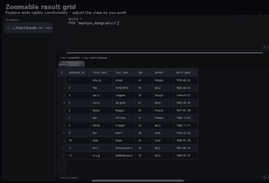
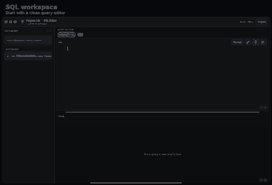

#<div align="center">


# Project Lily

### Your database workspace, built for Android.

SQL, SQLite, MySQL-style commands, data exploration, and learning —
all in an offline, tablet-friendly workspace.

`Android` · `Tablet` · `Offline` · `SQL`

</div>

## ✨ Built for working with SQL on Android

Project Lily keeps the workflow focused: **open a database → write SQL → run it → inspect the result**.

It also includes a command menu for secondary tools, multiple query tabs, import/export workflows, query history, saved snippets, schema-aware assistance, and SQL practice challenges.

---

## 🎬 See it in action

### ⋯ The command menu

The three-dot menu keeps the less frequently used tools out of the way while making them immediately accessible when you need them.

<p align="center">
  
</p>

**Available tools include:**

- Schema Inspector
- Table Designer
- Data Editor
- Query History
- Saved Snippets
- Practice

---

### 🔎 Result grids that you can actually explore

Results are designed for data exploration rather than just displaying a static table. The result area supports zoom controls, searching, and a virtualized grid for large result sets.

<p align="center">
  
</p>

---

### ⚡ From query to result

<p align="center">
  
</p>

Write SQL, format it, execute the current statement or a broader selection, then inspect the returned data without leaving the workspace.

---

## 🧩 Features

| Feature | What it does |
|---|---|
| 🗃️ Database browser | Browse databases and navigate tables and database objects |
| 📝 SQL editor | Line numbers, syntax highlighting, formatting and query tabs |
| ⚡ Query execution | Run the current statement, selection or broader query set |
| 🔍 Result exploration | Search results, zoom the grid and work with large result sets |
| ⋯ Command menu | Quick access to schema, design, data, history, snippets and practice |
| 📚 Query history | Keep track of previously executed SQL |
| 💾 Saved snippets | Keep useful SQL ready for reuse |
| 📥 Import | Work with SQLite databases, CSV/TSV, JSON and SQL dumps |
| 📤 Export | Export databases and query results |
| 🧠 SQL assistance | Schema-aware autocomplete and database lookups |
| 🎓 Practice | Built-in SQL challenges for hands-on learning |
| ⌨️ Keyboard shortcuts | Desktop-style shortcuts for faster workflows |
| 🌑 Dark UI | A compact, macOS-inspired interface designed for focused work |
| 📱 Android native | Built as an Android application with offline-first database work |

---

## 🧪 SQL practice

Project Lily includes a small practice mode for learning SQL against a bundled **Parks & Recreation** sample database.

Challenges cover tasks such as:

- filtering employees by age
- joining salary and demographic data
- finding the highest salaries
- grouping employees by gender
- exploring departments

---

## 📦 Import & export

Project Lily includes a custom Android file workflow for bringing data into the workspace.

Supported workflows include:

- SQLite / `.db`
- `.sqlite` / `.sqlite3`
- CSV / TSV
- JSON
- SQL dump files
- database export
- result export

---

## 🚀 Performance-focused

The editor is designed to keep the UI responsive while working with databases.

Recent performance work includes:

- background database/schema discovery
- background file-browser queries
- debounced SQL syntax highlighting
- virtualized result rendering
- bounded result-data handling
- interruptible lightweight UI transitions
- query/import cancellation

---

## 🔐 Offline by design

Project Lily is designed around local SQLite work on Android.

Your database work stays in the app instead of requiring a cloud SQL server for the core editor workflow.

---

## 🛠️ Tech stack

- **Kotlin**
- **Android SDK**
- **SQLite**
- **Android Storage Access Framework**
- **Gradle / Android Gradle Plugin**
- **Java 17**
- **Kotlin 2.x**

---

## 📱 Current release

**v4.4**

The project is built and released through GitHub Actions with a signed Android release APK.

<a href="https://github.com/MrDhar/Lily/releases/latest">Download the latest APK →</a>

---

## 🗺️ Project

```text
Project Lily
├── Android application
├── SQLite database engine
├── SQL editor
├── Database browser
├── Result grid
├── Import / export
├── Query history
├── Saved snippets
└── SQL practice
```

---

## ❤️ Open source

Project Lily is developed as an open-source Android project.

If you find something useful, have an idea, or spot a bug, feel free to open an issue or contribute.

<p align="center">
  <a href="https://github.com/MrDhar/Lily/issues">Report an issue</a>
  &nbsp; • &nbsp;
  <a href="https://github.com/MrDhar/Lily/releases">Releases</a>
  &nbsp; • &nbsp;
  <a href="https://github.com/MrDhar/Lily">GitHub</a>
</p>

---

<p align="center">
  <b>Project Lily</b><br>
  Query · Explore · Learn · Anywhere
</p>
